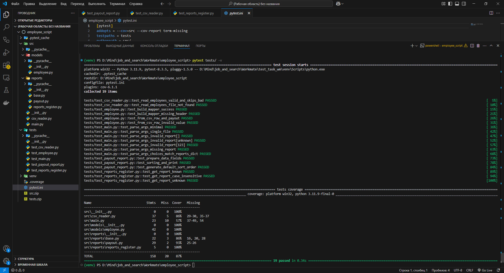

[](https://opensource.org/licenses/Apache-2.0)

## Скриншот с результатами запуска скрипта

 1) Корректный ввод параметров запуска
 2) Ошибка в названии отчета
 3) Ошибка в имени файла


## Скриншот с результатами запуска тестов



## Как добавить новый отчет

1) Создайте файл отчета в папке `src/reports/`

2) Создайте в файлк класс наследуемый от класса `BaseReport`

3) Для созданного класса переопределите методы следующие методы:
- `_prepare_data` (Обработка данных) 

- `_print` (Вывод данных) 

4) Зарегистрируйте отчет в файле `src/reports/reports_register.py`:
- Добавьте в словарь `REPORTS` название отчета и его класс


## Требования
- Python 3.8+.

- Зависимости (только для тестов): 
    ```cmd
    pip install -r requirements.txt
    ```
 ## Быстрый старт

1. Клонирование репозитория:
    ```cmd
    git clone https://github.com/RailSafiullin/emp_script
    cd emp_script
    ```

2. Запуск скрипта
    ```cmd
    python src\main.py ..\csv_docs\data1.csv ..\csv_docs\data2.csv ..\csv_docs\data3.csv --report
    ```

3. Запуск тестов
    ```cmd
    pytest
    ```

##  Архитектура проекта

- `main.py` — основная точка входа:

- `csv_reader.py` — для чтения CSV-файлов и преобразования данных в список объектов `Employee`

- `models/employee.py` — модель сотрудника, отвечает за парсинг строки и расчет выплат

- `reports/base.py` — абстрактный базовый класс отчетов (`BaseReport`)

- `reports/payout.py` — реализация отчета по выплатам

- `reports/reports_register.py` — словарь `REPORTS`, где хранятся доступные отчеты